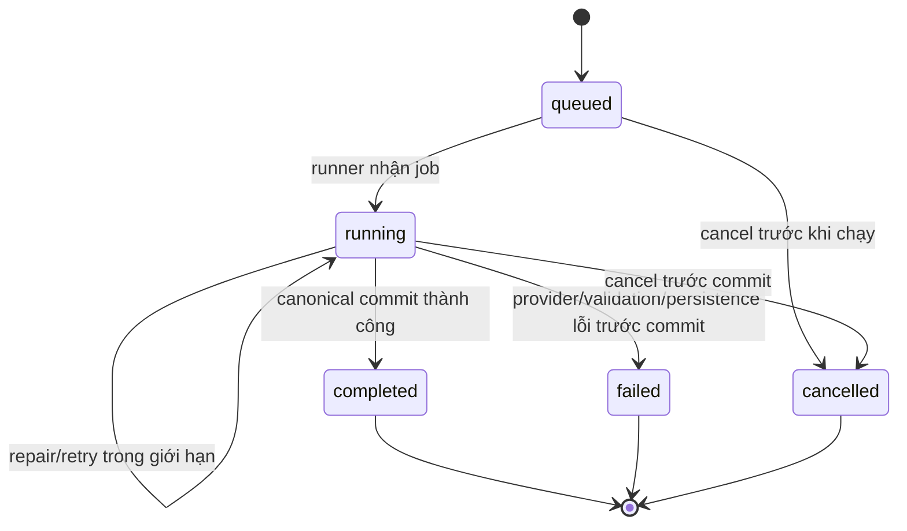
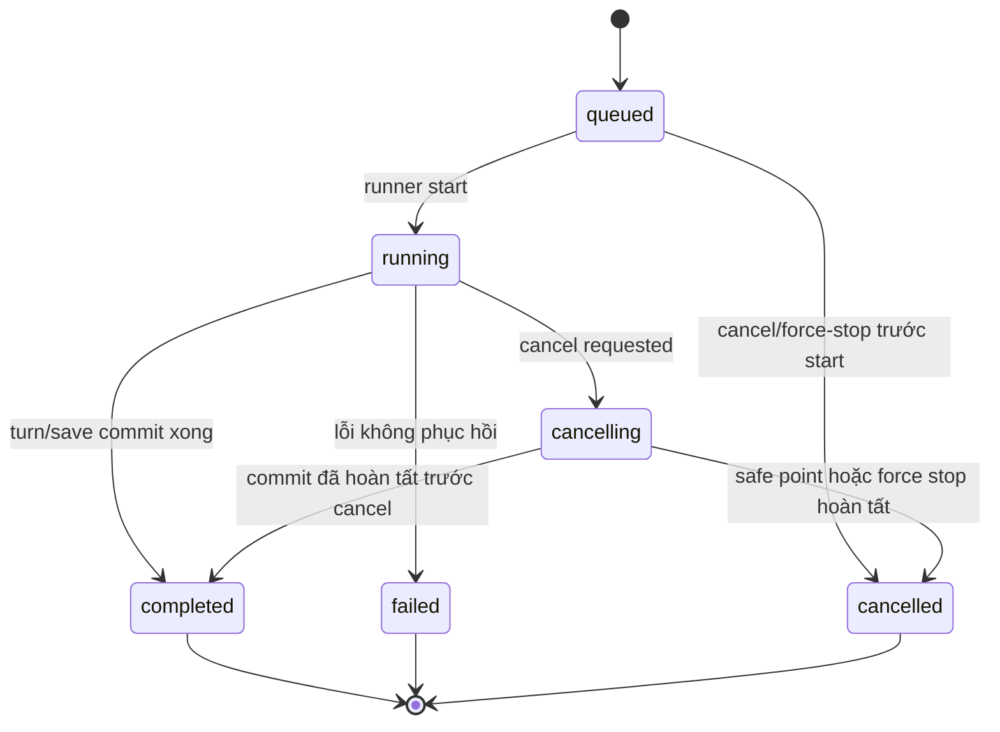
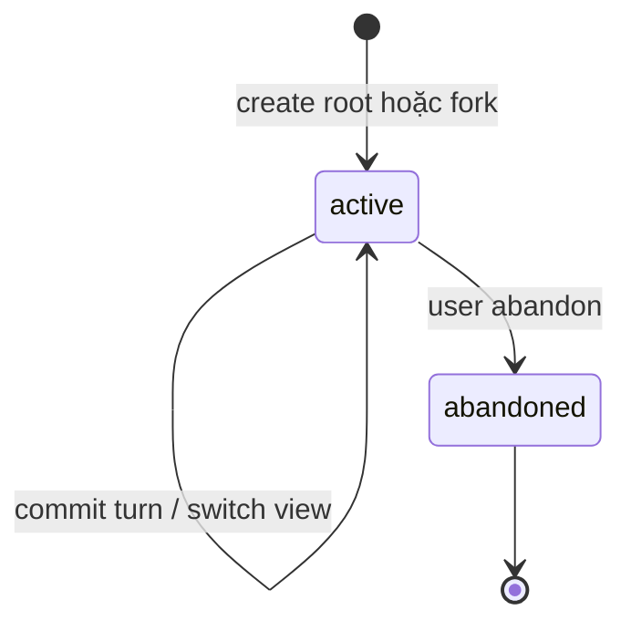
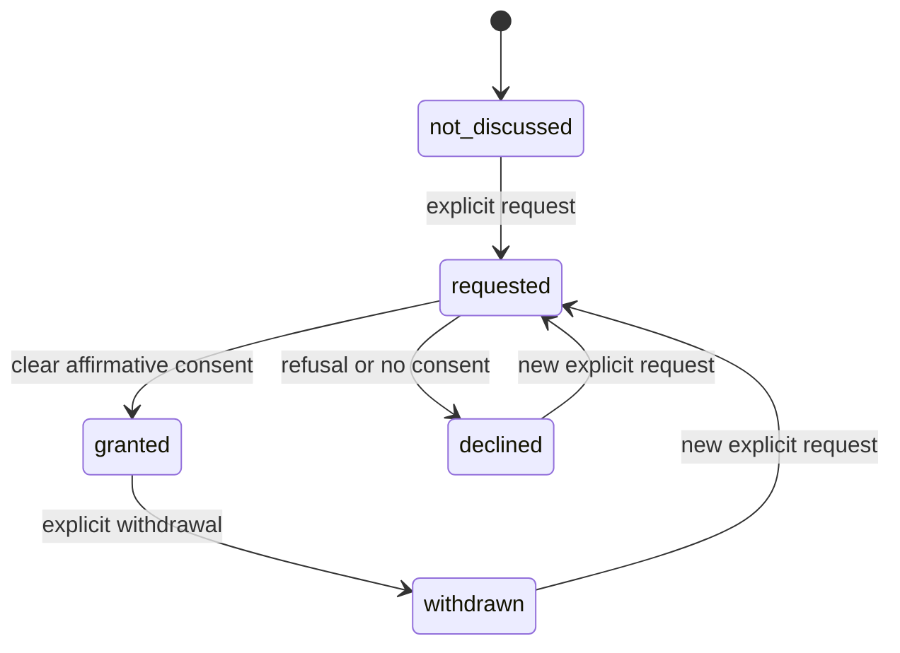

# State machines

Các state dưới đây là state sản phẩm/canonical. Node phase và SSE event có thể
chi tiết hơn nhưng không được tạo một lifecycle khác với các transition này.

## 1. Turn

`committing` là internal phase/SSE event nằm trong `running`; transaction
thành công mới đổi status thành `completed`. Nếu cancellation đến sau commit,
turn vẫn `completed` và UI không được hiển thị `cancelled` giả.

Canonical guards:

- `queued → running` chỉ một runner sở hữu `turn_run_id`;
- `running → completed` chỉ qua một canonical commit idempotency key;
- lỗi/cancel trước commit không để state patch dở;
- base revision stale làm turn `failed` với mã giải thích, không đổi head.

## 2. Background job

Job status phục vụ điều phối/SSE; `Turn.status` vẫn là authority của turn.
Restart app đánh dấu job non-terminal đang chạy thành `failed/interrupted`,
không tự đoán rằng canonical commit đã xảy ra. Reconnect đọc snapshot REST rồi
mới nhận event còn trong buffer.

## 3. Branch

Branch con không phải bản copy event. Nó giữ `parent_branch_id`,
`fork_turn_id`, `depth`, `head_turn_id`, `head_revision` và query ancestry. Root
không có parent/fork. Regenerate tạo branch mới; undo chỉ move head khi không
có descendant sau điểm undo.

## 4. Consent

Consent là state machine theo `(scene_id, participant_id, activity_tag)`:

Không có transition tự động từ relationship score, blush, silence, intoxication
hoặc prior consent. `declined`/`withdrawn` chặn activity hiện tại cho tới khi
có request mới và affirmative consent phù hợp; age/rating/policy vẫn phải pass.

## 5. Content decision

Guard trả một trong ba kết quả deterministic:

| Decision | Nghĩa |
|---|---|
| `allow` | SceneSpec đúng age/rating/topic/violence/consent |
| `downgrade` | Outcome/story beat có thể giữ nhưng phải hạ tag/mức mô tả |
| `deny` | Không được materialize scene hoặc proposal |

Decision có `reason_codes`, participant ages, effective policy version và
`evaluated_world_time`; không dùng text model để thay quyết định Guard.
